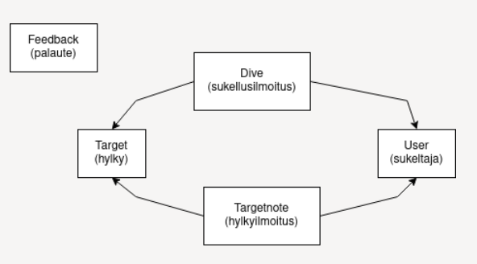

# Sukellusilmoitus backend

[](https://github.com/Sukellusilmoitus/backend/actions)
[](https://app.codecov.io/gh/Sukellusilmoitus/backend)

## Heroku

Tuotantoserveri [Herokussa](https://sukellusilmo-back-staging.herokuapp.com/).\
Testiserveri [Herokussa](https://sukellusilmo-back-test.herokuapp.com/).

## Asennus

Varmista, että laitteellasi on Python 3.8 tai uudempi. Luo virtuaaliympäristö ja asenna riippuvuudet

```bash
python3 -m venv venv
source venv/bin/activate
pip install -r ./requirements.txt
```

Määritä palvelimelle ympäristömuuttujat luomalla tiedosto `.env` projektin juureen

```bash
MONGO_URI=tuotantotietokanta
TEST_MONGO_URI=testauksessa käytettävä tietokanta
SECRET_KEY=salausavain
```

Tämän jälkeen voit käynnistää palvelimen

```bash
python3 src/index.py
```

Jos `curl http://localhost:5000/api/healthcheck` ei tuota virhettä, palvelin toimii.

## Komentoja

### Testaus

Testit testaavat myös sovelluksen REST-rajapintoja, joten sovelluksen tulee olla käynnissä testien ajon aikana testiympäristössä. Sovellus käynnistyy testiympäristöön seuraavasti

```bash
TEST=True python3 src/index.python3
```

Kaikkien testien suorittaminen onnistuu komennolla

```bash
pytest
```

Jos haluat jättää rajapintatestit suorittamatta, se onnistuu komennolla

```bash
pytest -m "not api"
```

Tällä komennolla testejä suorittaessa, sovelluksen ei tarvitse olla käynnissä.

### Pylint

```bash
pylint src
```

### Koodin formatointi

```bash
autopep8 --in-place --aggressive --aggressive --recursive src
```

### Uusien riippuvuuksien asentaminen

```bash
pip install <package>
pip freeze > requirements.txt
```

## Hylkydata 

Hylkyjen tiedot tulevat kahdesta lähteestä: Itämeri.fi -sivulta ja Museoviraston sivulta. Molemmat datat on tuottanut Museovirasto. Jos lähteet muuttuvat, skripti `fetch_from_museovirasto.py` täytyy kirjoittaa uuteen dataan sopivaksi. 

Hylkydata päivittyy joka keskiviikkoaamu. Tietokantoihin haetaan uudet hylyt tai päivitetään muutokset id:n perusteella, mitään ei poisteta. Päivitysskriptin ajaa Github actionsin workflow Updater backendin puolella. 

## Datalähteet:

https://ckanmtp.ymparisto.fi/dataset/muinaismuistolailla-rauhoitetut-ja-muut-historialliset-hylyt-merialueilla-wfs-palvelu 

https://www.museovirasto.fi/fi/palvelut-ja-ohjeet/tietojarjestelmat/kulttuuriympariston-tietojarjestelmat/kulttuuriympaeristoen-paikkatietoaineistot (tutkija.zip) 

## Meiliherätteet

Sovellus lähettää joka maanantai viikon ajalta uudet ilmoitukset meilillä backin ympäristömuuttujissa määritettyyn sähköpostiin. Lähetysskriptin ajaa Github actionsin workflow Emailer backendissä. Lähettäjän ja vastaanottajan osoitteet on backin Github secretseissä. 


## Tietokannan rakenne


## Definition of done

Scrumin mukaisesti projektissa toteutetaan backlogista löytyvät user storyt,
joille on jokaiselle määritelty hyväksymiskriteerit.
Projektin product- ja sprint-backlogit ja siten myös hyväksymiskriteerit löytyvät tästä sheetistä: [backlogit](https://helsinkifi-my.sharepoint.com/:x:/g/personal/amikko_ad_helsinki_fi/EaUHpV9XQy1BmeSrSOFVoi8BKp4hDY_YXGRn8sG6nbl1oA?rtime=T01JVzDb2Ug)

Hyväksymiskriteerit testataan käyttäen Cypressia.
Koodia testataan kattavasti myös yksikkötesteillä.
Koodityyli noudattaa lintin avulla määriteltyjä sääntöjä.

Asiakas voi seurata koodin ja testien tilannetta CI-palvelusta:

- Frontend: [codecov](https://app.codecov.io/gh/Sukellusilmoitus/frontend)
- Backend: [codecov](https://app.codecov.io/gh/Sukellusilmoitus/backend)

Koodin arkkitehtuuri on suunniteltua ja perusteltua,
pyrkimyksenä on mahdollisimman hyvä ylläpidettävyys pitämällä koodi selkeänä.

### Tarkistuslista User Storylle

- Tuotettu koodia suunnitelluille toiminnallisuuksille
- User storyn vaatimuksiin vastattu
- Projekti käynnistyy ilman virheitä
- Unit testit kirjoitettu ja läpäisty
- Toiminnallisuus on testattu hyväksymistesteillä
- Refraktorointi on valmis
- Product ownerin mielestä toiminnallisuus on valmis

### Tarkistuslista Sprintille

- Definition of done sprintin user storyille täytetty
- Kaikki unit testit läpäisty
- Linttaus läpäisty
- Backlog on päivitetty
- Kaikki bugit on korjattu
- Sprintin toteutettu toiminallisuus käyty läpi Product Ownerin kanssa
- Sprinttiin liittyvät "to do" asiat valmiita

### Tarkistuslista viimeiselle Releaselle

- Koodi on valmista
- Kaikki testit läpäisevät
- Kaikki hyväksymiskriteerit täyttyvät
- Ryhmä on hyväksynyt releasen
- Ei keskeneräistä työtä releasen mukana
- Kaikki DoD asetetut vaatimukset täyttyvät
